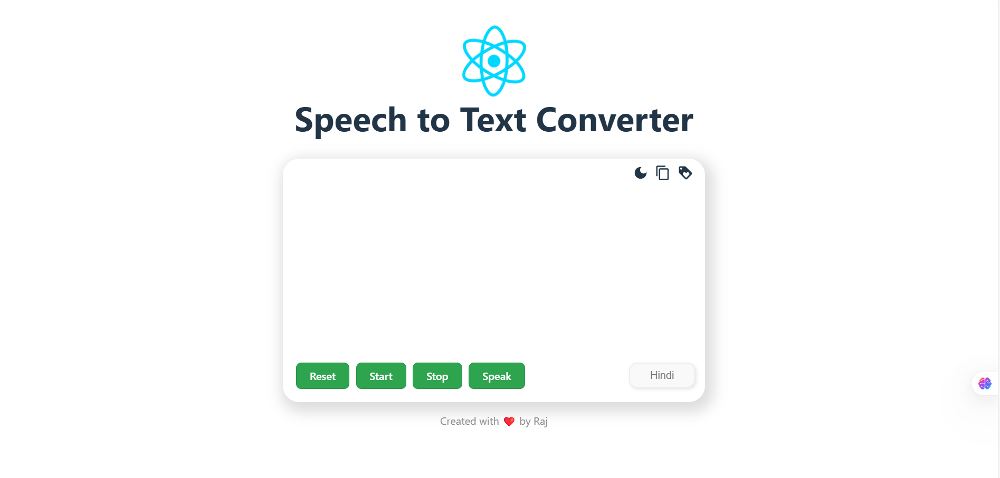
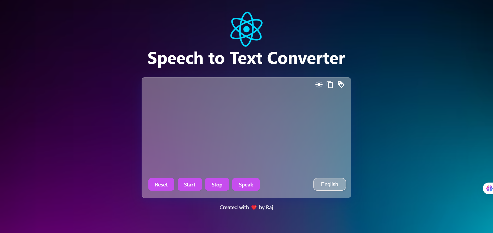

# Speech Recognition and Dark Mode Web Application

## Table of Contents
- [Project Overview](#project-overview)
- [Features](#features)
- [Technologies Used](#technologies-used)
- [Installation](#installation)
- [Usage](#usage)
- [Screenshots](#screenshots)
- [Future Enhancements](#future-enhancements)
- [Contributing](#contributing)
- [License](#license)

## Project Overview
This web application leverages speech recognition and synthesis technologies to provide real-time transcription of speech input and text-to-speech functionality. It includes additional features such as dark mode, clipboard copying, and multi-language support, enhancing user accessibility and customization.

## Features
- **Speech-to-Text (Real-Time Transcription)**
  - Supports multiple languages including English, Hindi, Arabic, Japanese, and Chinese.
- **Text-to-Speech Playback**
  - Read aloud the transcribed text with adjustable language settings.
- **Dark Mode Toggle**
  - Switch between light and dark themes for better user experience.
- **Copy Transcript to Clipboard**
  - Copy the transcribed text with a single click.
- **User Controls**
  - Reset, start, stop listening, and speak text commands for improved interactivity.
- **Language Selection**
  - Easily change languages for speech recognition and synthesis.

## Technologies Used
- **Frontend:** React, Material UI, CSS
- **Speech Recognition:** Web Speech API
- **Icons:** Material UI Icons
- **State Management:** React Hooks

## Installation
### Clone the repository:
```bash
git clone <repository_url>
cd <project_directory>
```

### Install dependencies:
```bash
npm install
```

### Start the development server:
```bash
npm start
```

## Usage
- **Start Transcription:** Click the "Start" button to begin real-time speech-to-text transcription.
- **Speak Text:** Click the "Speak" button to hear the transcript read aloud.
- **Dark Mode Toggle:** Click the moon/sun icon to switch between light and dark modes.
- **Copy Transcript:** Click the clipboard icon to copy the text to the clipboard.
- **Language Selection:** Use the dropdown to select the language for speech recognition.

## Screenshots
- **Light Mode Interface:**
  

- **Dark Mode Interface:**
  

## Future Enhancements
- Add pitch and rate controls for text-to-speech playback.
- Save and manage transcript history.
- Improve mobile responsiveness for better user experience on smaller screens.
- Integrate pause and resume functionality for speech synthesis.

## Contributing
Contributions are welcome! Please follow these steps:
1. Fork the project.
2. Create a new branch:
   ```bash
   git checkout -b feature/YourFeature
   ```
3. Commit your changes:
   ```bash
   git commit -m 'Add new feature'
   ```
4. Push the changes:
   ```bash
   git push origin feature/YourFeature
   ```
5. Submit a pull request.

## License
This project is licensed under the MIT License.

